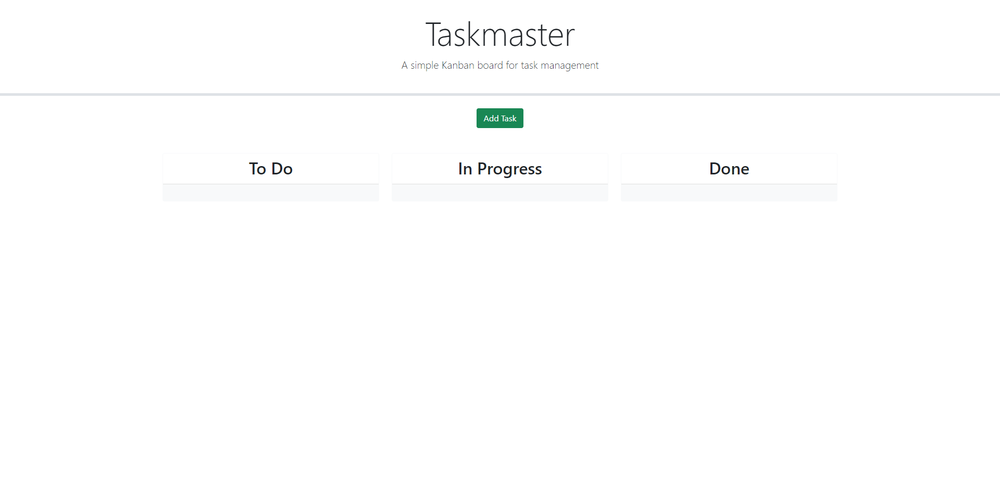
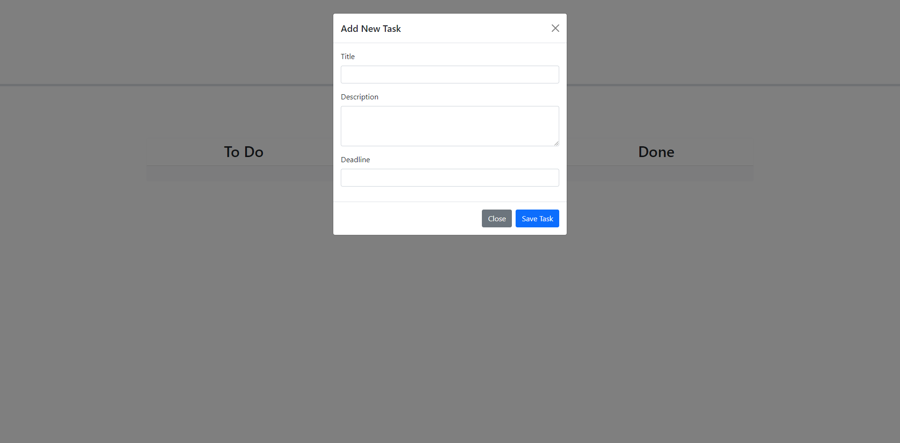
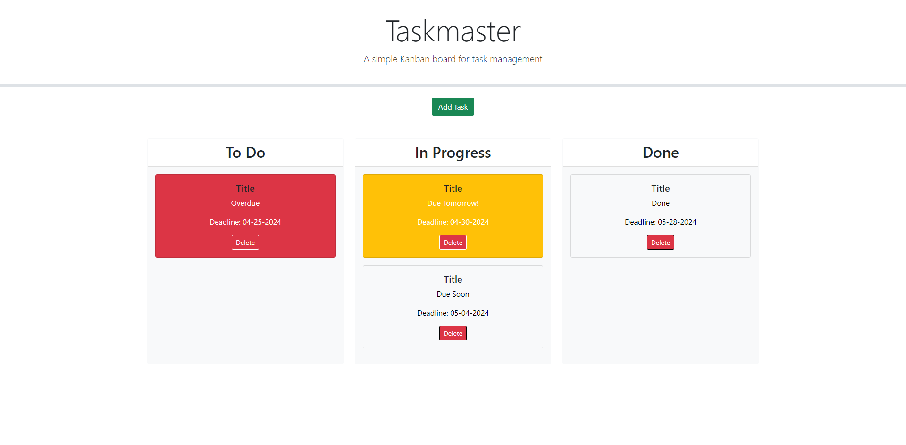

# Taskmaster

 

## Desciption 

Taskmaster is a simple Kanban board application designed to help project teams organize and manage their tasks efficiently. It provides a visual representation of project tasks across different stages of completion, allowing users to easily track progress and prioritize work items. With Taskmaster, users can add, update, and delete tasks, as well as drag and drop tasks between different progress states.

## Usage

1.  <b>Adding Tasks:</b> Click the "Add Task" button to open the modal dialog. Enter the task title, description, and deadline date in the respective fields. Click "Save Task" to add the task to the board. The modal will automatically close after saving the task.
2.  <b>Managing Tasks:</b> Each task card displays the task title, description, and deadline date. Tasks are color-coded based on their proximity to the deadline, with red indicating overdue tasks and yellow indicating tasks nearing the deadline. To delete a task, click the "Delete" button on the task card. To update the status of a task, drag and drop the task card between the "To Do," "In Progress," and "Done" columns.
3.  <b>Persistence:</b> Task data is stored locally using browser localStorage, ensuring that tasks persist even after page refresh.

Taskmaster provides a user-friendly interface for task management, making it an ideal tool for project teams with multiple tasks to organize.

The following image shows the web application's appearance and functionality: 

[Visit my website](https://haartmuhn.github.io/taskmaster/)

## License 

[MIT License](https://opensource.org/licenses/MIT)